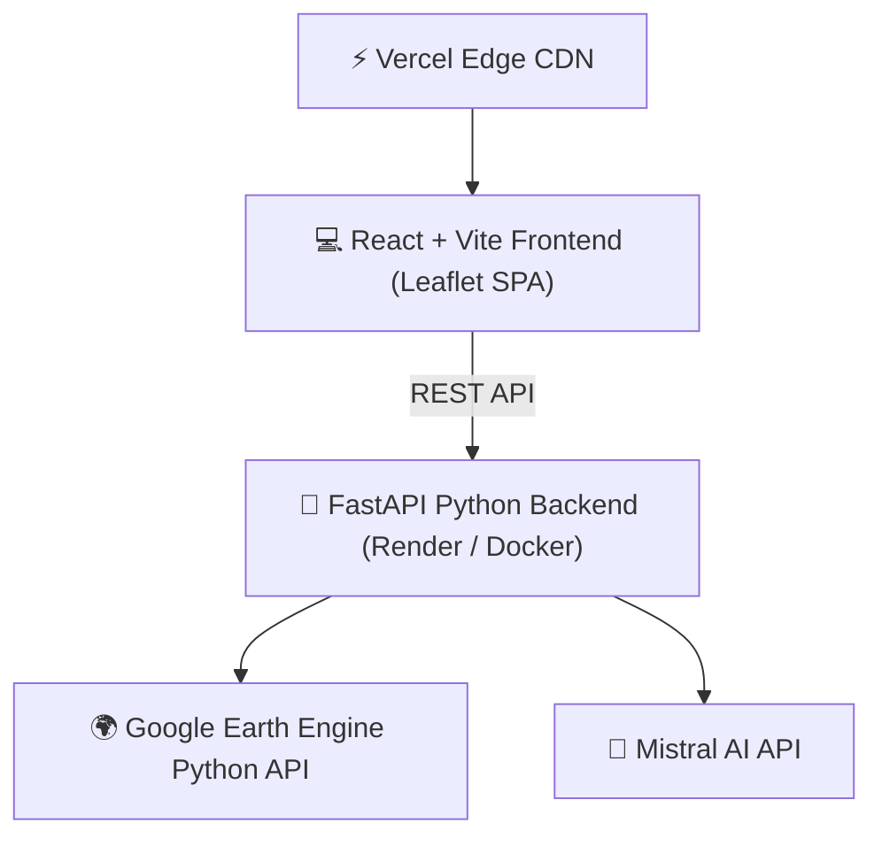

# 🛰️ Orbiter Fusion Platform (ASTRAVISION)
> **Next-Generation Multi-Satellite Data Fusion & Autonomous AI Intelligence Platform**

[](https://docker.com)
[](https://fastapi.tiangolo.com/)
[](https://vitejs.dev/)
[](https://earthengine.google.com/)
[](https://mistral.ai/)

---

## 🌟 Executive Overview
**Orbiter Fusion** is a state-of-the-art Earth Observation intelligence platform designed to eliminate satellite telemetry trade-offs. By fusing **Sentinel-2** (ESA 10m Optical), **Landsat 8/9** (NASA/USGS 30m/100m Thermal), and **Sentinel-1** (ESA C-Band SAR Radar), Orbiter Fusion delivers **gap-free, cloud-penetrating, high-resolution multi-spectral analytics** in real-time.

---

## 🚀 Key Features & Innovations

### 1. 🛰️ Multi-Sensor Gap-Fill Fusion Engine
* **Spatial & Spectral Harmonization**: Upsamples 30m Landsat-8/9 bands to align with 10m Sentinel-2 grids using HLS (Harmonized Landsat-Sentinel) conventions.
* **Server-Side Compositing**: Computes cloud-masked, multi-sensor tile streams live via Google Earth Engine.

### 2. 💡 13 Multi-Spectral & Super-Resolution Modes
Includes academic scientific provenance badges on every index card:

| Mode | Type | Provenance | Academic Reference / Model |
| :--- | :--- | :--- | :--- |
| **True Color (Natural RGB)** | Optical Composite | 🛰️ Measured | Reflectance stretched $0.0 - 0.35$ |
| **Gap-Fill Fusion** | Harmonized S2+L8 | 📐 Modeled | Claverie et al. (2018) HLS |
| **NDVI (Vegetation Index)** | Health & Canopy | 🛰️ Measured | Rouse et al. (1973) $[0.0 - 0.8]$ |
| **NDWI (Water Index)** | Hydro Surface | 🛰️ Measured | McFeeters (1996) $[-0.3 - 0.4]$ |
| **NDBI (Built-up Index)** | Urban Density | 🛰️ Measured | Zha et al. (2003) |
| **NIR Composite** | Agriculture Vigor | 🛰️ Measured | Standard False-Color Infrared |
| **SWIR Composite** | Soil Moisture | 🛰️ Measured | Shortwave Infrared Water Stress |
| **SCI (Soil Composition)** | Geology & Minerals | 🛰️ Measured | Mineral Absorption Spectroscopy |
| **LST (Land Temp - Raw)** | Thermal IR | 🛰️ Measured | Landsat-8 TIRS Band 10 |
| **RealLST (Emissivity Adj.)** | Kelvin-to-Celsius | 📐 Modeled | Sobrino et al. (2004) split-window |
| **Thermal 10m Super-Res** | Downscaled Temp | 📐 Modeled | Agam et al. (2007) TsHARP 10m |
| **SAR Radar (C-Band)** | Cloud-Penetrating | 🧪 Demo | Sentinel-1 VV/VH backscatter |

### 3. 🤖 Autonomous ASTRA-AI Agent
* **Natural Language Queries**: Powered by **Mistral AI Engine** (`mistral-small-latest`).
* **Automated Risk Scanning**: Scans targets for illegal deforestation, wildfire risk, water reservoir depletion, and urban heat islands.
* **GPS Alert Layer**: Renders interactive warning pins and anomaly polygon overlays on the map.

### 4. 📈 ESG Carbon & Biomass Sequestration Accounting
* **Biomass Density Calculator**: Estimates dry biomass tonnage ($T/\text{ha}$) from multi-spectral NDVI canopy density.
* **Carbon Credit Valuation**: Computes total carbon stock, $\text{CO}_2\text{e}$ sequestration equivalent, and monetary credit valuation ($25/\text{Ton}$).

### 5. 📑 Executive PDF & Interactive Swipe Compare
* **↔️ Swipe Compare Slider**: Drag a vertical split-screen divider to compare satellite layers side-by-side.
* **📄 1-Click Executive PDF**: Generates printable environmental intelligence reports with verified telemetry tables.

---

## 🏗️ Architecture & Tech Stack



* **Frontend**: React 18, Vite, Leaflet, Glassmorphism CSS design system.
* **Backend**: Python 3.11, FastAPI, Uvicorn, Pydantic v2.
* **Engine**: Google Earth Engine Python API, Mistral AI REST API.

---

## 📦 Quickstart & Installation

### Option A: 1-Command Docker Launch (Recommended)
```bash
docker compose up --build
```
Access the application at **`http://localhost:5173`**!

---

### Option B: Manual Local Setup

#### 1. Backend Setup
```bash
cd backend
python -m venv .venv
.venv\Scripts\activate      # On Windows
pip install -r requirements.txt

# Create .env file with your GEE Project and Mistral API Key:
# ORBITER_GEE_PROJECT=your-gee-project-id
# MISTRAL_API_KEY=your-mistral-api-key

python -m uvicorn app.main:app --reload --port 8000
```

#### 2. Frontend Setup
```bash
cd frontend
npm install
npm run dev
```

---

## 🧪 Testing & Verification

Run end-to-end browser tests via Playwright:
```bash
cd frontend
npx playwright test
```
