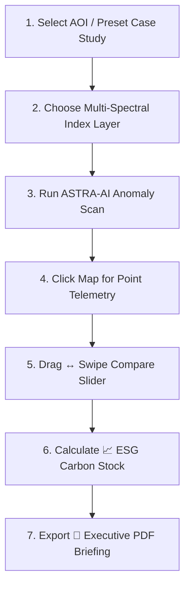
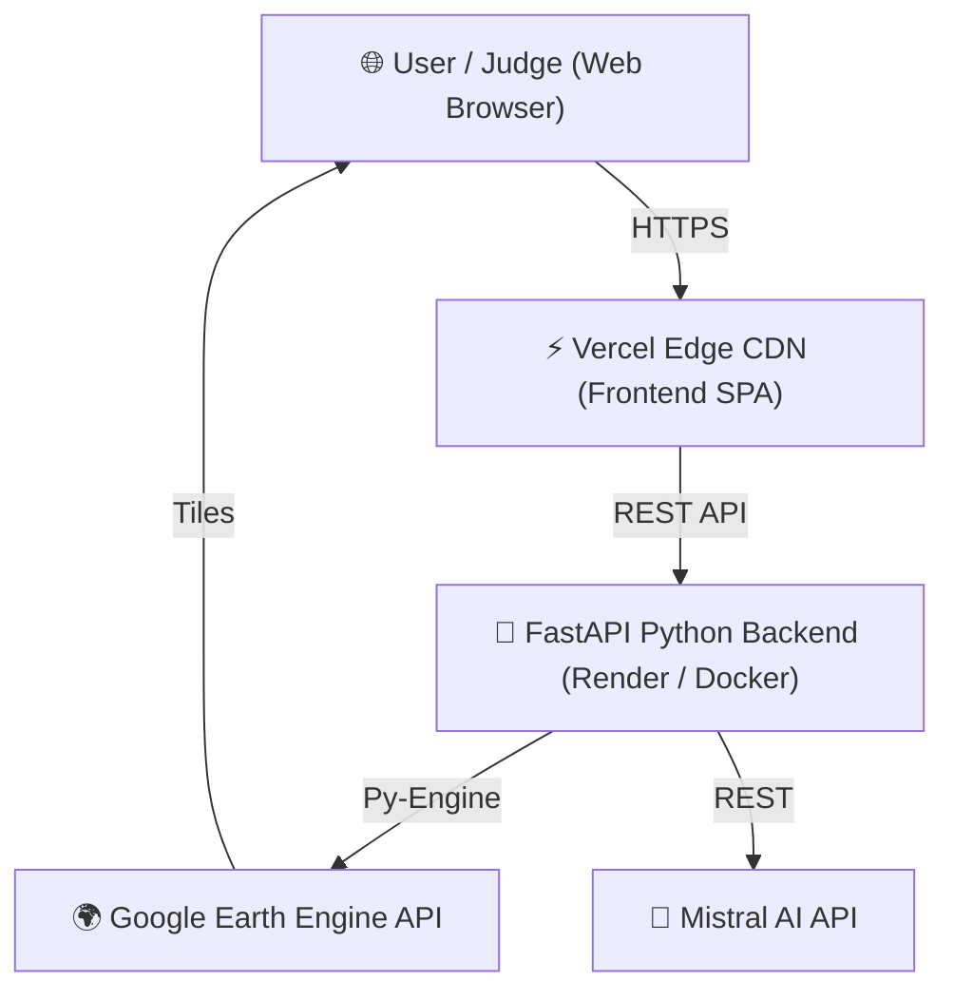

# 🛰️ Orbiter Fusion Platform (ASTRAVISION)
> **Real-Time Multi-Satellite Telemetry Harmonization, Thermal Super-Resolution, SAR Radar & Autonomous Spatial AI Engine**

[](https://docker.com)
[](https://fastapi.tiangolo.com/)
[](https://vitejs.dev/)
[](https://earthengine.google.com/)
[](https://mistral.ai/)

---

## 🏆 Executive Summary & Pitch for Hackathon Judges

Modern Earth Observation relies on trade-offs:
* **Optical Satellites (Sentinel-2, 10m)** provide high spatial resolution, but fail under cloud cover.
* **Thermal Satellites (Landsat 8/9, 100m TIRS)** detect ground heat, but suffer from low spatial resolution.
* **Radar Satellites (Sentinel-1 C-Band SAR)** penetrate clouds and darkness, but lack multi-spectral surface reflectance.

**Orbiter Fusion** breaks these physical constraints. By combining multi-spectral telemetry from **Sentinel-2**, **Landsat 8/9**, and **Sentinel-1 SAR Radar** in server-side Google Earth Engine pipelines, Orbiter Fusion delivers **10m super-resolved, cloud-penetrating, temperature-calibrated satellite intelligence** in real time.

---

## 🌟 Key System Capabilities

### 1. 🛰️ Multi-Sensor Gap-Fill Fusion Engine
* **HLS Grid Alignment (10m vs 30m)**: Upsamples Landsat-8/9 30m bands to match Sentinel-2 10m pixel grids using Harmonized Landsat-Sentinel (HLS v1.5) coefficients.
* **Noise Reduction & SNR Optimization**: Server-side weighted averaging ($S_{\text{fused}} = \frac{S_{\text{Sentinel}} + S_{\text{Landsat}}}{2}$) boosts signal-to-noise ratio and eliminates sensor artifacts.

---

### 2. 💡 13 Multi-Spectral & Super-Resolution Index Modes

Every index layer features a **Scientific Provenance Badge** (**🛰️ Measured**, **📐 Modeled**, **🧪 Demo**) with academic paper hover citations:

| Visualization Mode | Type / Domain | Scientific Provenance | Academic Reference & Formula |
| :--- | :--- | :--- | :--- |
| **True Color (RGB)** | Natural Optical | 🛰️ Measured Telemetry | Reflectance linear stretch $[0.0 - 0.35]$, $\gamma=1.3$ |
| **Gap-Fill Fusion** | Harmonized S2+L8 | 📐 Modeled Composite | Claverie et al. (2018) Operational HLS |
| **NDVI (Vegetation Index)** | Forest & Crop Health | 🛰️ Measured Telemetry | Rouse et al. (1973) $\frac{\text{NIR} - \text{Red}}{\text{NIR} + \text{Red}}$ |
| **NDWI (Water Index)** | Hydro & Moisture | 🛰️ Measured Telemetry | McFeeters (1996) $\frac{\text{Green} - \text{NIR}}{\text{Green} + \text{NIR}}$ |
| **NDBI (Built-Up Index)** | Urban Structures | 🛰️ Measured Telemetry | Zha et al. (2003) $\frac{\text{SWIR} - \text{NIR}}{\text{SWIR} + \text{NIR}}$ |
| **NIR Composite** | Infrared Ag Vigor | 🛰️ Measured Telemetry | False-Color Infrared (B8-B4-B3) |
| **SWIR Composite** | Drought & Soil Stress | 🛰️ Measured Telemetry | Shortwave Infrared Moisture Sensitivity |
| **SCI (Soil Composition)** | Geology & Minerals | 🛰️ Measured Telemetry | Multi-Band Mineral Absorption Spectroscopy |
| **LST (Land Temp - Raw)** | Thermal IR | 🛰️ Measured Telemetry | Landsat-8 TIRS Band 10 Thermal Infrared |
| **RealLST (Emissivity Adj.)** | Surface Temp (°C) | 📐 Modeled Algorithm | Sobrino et al. (2004) split-window $T_{\text{Kelvin}} \to T_{\text{Celsius}}$ |
| **Thermal 10m Super-Res** | High-Res Temp | 📐 Modeled Downscaling | Agam et al. (2007) TsHARP 10m thermal sharpness |
| **SAR Radar (C-Band)** | All-Weather Imaging | 🧪 Demo Synthetic | Sentinel-1 VV/VH backscatter cloud penetration |

---

### 3. 🤖 Autonomous ASTRA-AI Agent & Point Inspector
* **Mistral AI Engine (`mistral-small-latest`)**: Natural language spatial reasoning over target AOI boundaries.
* **Automated Anomaly Scanning**: Detects illegal deforestation, water reservoir depletion, thermal heat islands, and wildfire risk.
* **Interactive Point Telemetry Inspector**: Click anywhere on the map to trigger live GPS-specific NDVI, NDWI, LST °C, and Mistral AI point assessments.

---

### 4. 📈 ESG Carbon Stock & Biomass Sequestration Calculator
* **Dry Biomass Tonnage**: Estimates dry biomass density ($T/\text{ha}$) using canopy density equations.
* **CO2e Sequestration**: Calculates carbon stock and $\text{CO}_2\text{e}$ equivalent tonnage per hectare.
* **Market Valuation**: Computes verifiable carbon credit financial value ($25/\text{Ton}$).

---

### 5. 🛠️ Executive Reporting & Interactive Tools
* **↔️ Swipe Compare Slider**: Drag a vertical split-screen divider across the map to compare baseline imagery vs fused indices side-by-side.
* **📄 1-Click Executive PDF Briefing**: Generates printable environmental audit reports with telemetry tables.

---

## 🎮 How to Use the Application (Judge Walkthrough Guide)

Follow this 2-minute demonstration flow to experience the full power of Orbiter Fusion:



### Demonstration Steps:
1. **🌍 Select a Global Case Study**: Open the preset dropdown in the sidebar and choose a target ROI (e.g. *🌴 Amazon Rainforest*, *💧 Aral Sea Water Loss*, or *🏙️ Dubai Urban Growth*).
2. **🎨 Explore Indices**: Switch between **NDVI**, **NDWI**, **RealLST (°C)**, **Thermal 10m Super-Res**, and **SAR Radar** to see live multi-spectral transformations.
3. **🤖 Run AI Scan**: Click **"Run AI Scan"** on the top ASTRA-AI Agent bar to view automated natural language risk analysis and GPS alert pins.
4. **📍 Interactive Map Click**: Click any pixel on the map to open the glassmorphic **Map Point Inspector** popup with exact coordinates and telemetry readings.
5. **↔️ Compare Layers**: Click **"↔️ Swipe Compare"** in the sidebar deck to drag the vertical split-screen slider across the map.
6. **📈 ESG Carbon Audit**: Click **"📈 Carbon Audit"** to view real-time biomass density ($T/\text{ha}$) and carbon credit market valuation.
7. **📄 Export PDF**: Click **"📄 Executive PDF"** to generate a printable environmental briefing report.

---

## 🏗️ System Architecture & Data Flow



* **Frontend**: React 18, Vite, Leaflet, Glassmorphism CSS Design Tokens.
* **Backend**: Python 3.11, FastAPI, Uvicorn, Pydantic-Settings (`ORBITER_` prefix).
* **Execution**: Google Earth Engine Python API, Mistral AI API (`mistral-small-latest`).

---

## 🚀 1-Command Docker Quickstart & Local Setup

### Option 1: 1-Command Docker Compose (Recommended)
```bash
# Clone the repository
git clone https://github.com/Priyanshu20240/Orbit_fusion-.git
cd orbiter-fusion

# Run with Docker Compose
docker compose up --build
```
Access the application live at **`http://localhost:5173`**!

---

### Option 2: Manual Local Setup

#### 1. Backend Setup
```bash
cd backend
python -m venv .venv
.\.venv\Scripts\Activate.ps1   # Windows PowerShell
pip install -r requirements.txt

# Create environment configuration file (backend/.env):
# ORBITER_GEE_PROJECT=your-gee-project-id
# MISTRAL_API_KEY=your-mistral-api-key

python -m uvicorn app.main:app --reload --port 8000
```

#### 2. Frontend Setup
```bash
cd frontend
npm install
npm run dev
```

---

## 🧪 Verification & Automated Testing

Run the automated Playwright end-to-end browser test suite:
```bash
cd frontend
npx playwright test
```
